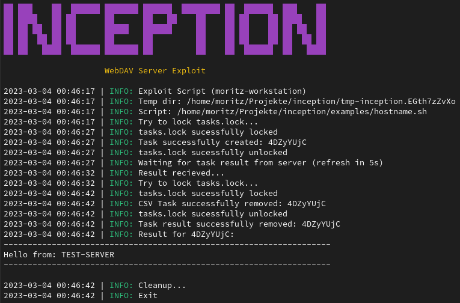

<h1 align="center">Inception</h1>

<p align="center"><b>WebDAV Server Xploiter</b></p>

<div align="center">
  <p>
    
  </p>
  <p>
    
    
  </p>
</div>

# Usage

```
# Start Server (Remote)
./inception --server

# Exploit Script (Client)
./inception <script>

# Show History (Client)
./inception --history

# Clear WebDAV (Client)
./inception --clear
```

# WebDAV Test Server

```
docker run --name webdav -v /tmp/webdav:/var/lib/dav -e AUTH_TYPE=Basic -e USERNAME=test -e PASSWORD=secret123 -p 8080:80 bytemark/webdav
```
